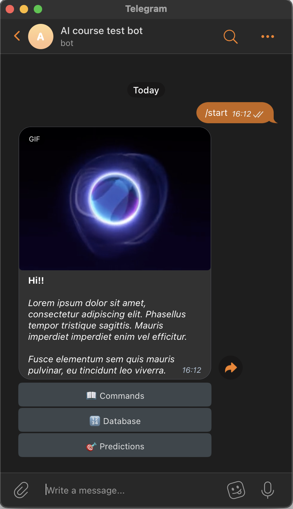

# INTRODUCTION
This Telegram bot is designed to control a blockchain and interact with the Binance cryptocurrency exchange. The bot also fetches news data and stores it in a SQLite database, where it is aggregated and used to create a predictive model. The model can be used to predict future prices on the exchange.

# INSTALATION
- Clone the repository to your local machine.
- Make copy of `.env.example` file, rename to `.env`, fill necessary data.
- Run `poetry install` to install the necessary libraries.
- Run `source .venv/bin/activate` to activate environment.
- Run `python app.py` to start the bot.

# USAGE

1. Start a chat with the bot on Telegram (https://t.me/ai_course_test_bot)
2. Use the following commands to interact with the bot:
    - /start: Command for start
    - /database: Command for database overview
    - /predict: Command to predict prices.
    - /scrape: Command for start scraper, scraper will scrape all websites links from https://cryptolinks.com
    - /fetch_blocks: Command to fetch blocks data, sync all blocks from latest on db till latest on chain. 
            Use `/fetch_blocks 101 159` for custom range.
    - /fetch_ticker: Command to fetch ticker data, sync all candles from latest on db till latest on exchange. 
            Use `/fetch_ticker ETHUSDT` for ETH and USDT ticker.

# EXAMPLES
    `/start`

# SUPPORT

If you have any issues or questions, please contact the developer or open an issue on the GitHub repository

# LICENSING

This project is licensed under the MIT license. See the LICENSE file for more information.

# CONTRIBUTION

If you would like to contribute to the development of this bot, please submit a pull request or issue on the GitHub repository.